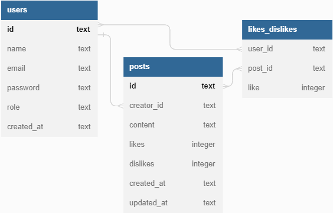

# `Projeto Labook`



# `Descrição`
[Projeto desenvolvido no curso Labenu]. </br>
O Projeto Labook-backend foi desenvolvido como uma atividade dentro do curso Full-Stack Web Developer da Labenu, o qual consiste na elaboração de uma API que retorna dados conforme as requisições enviadas. Trata-se de uma ferramenta de cadastro de usuários e posts.

A documentação da API pode ser acessada [aqui](https://documenter.getpostman.com/view/24823058/2s93sXcubN).

# `Modo de usar`
As requisições que podem ser feitas são:  

- **[POST] signup:** cria um novo usuário, fornecendo (via body) nome, email, password e role.
- **[GET] login:** faz o login em uma conta, fornecendo (via body) email e password.
- **[POST] createPost:** criar um novo post, fornecendo (via body) o conteúdo do post. Necessita de autenticação.
- **[GET] getPosts:** busca todos os posts. Necessita de autenticação.
- **[PUT] editPost:** edita um post, fornecendo (via body) o conteúdo a ser alterado post. Necessita de autenticação.
- **[PUT] likeOrDislikePost:** utilizado para dar "like" ou "dislike" em um determinado post, fornecendo (via path params) o id do post. Necessita de autenticação.
- **[DEL] deletePost:** deleta um post, fornecendo (via path params) o id do post. Necessita de autenticação ou autorização.

# `Instalando e rodando o projeto`
Fazer o clone do projeto:
- git clone link-do-repositório

Instalar as dependências:
- npm install

Rodar o projeto:
- npm run dev

# `Tecnologias utilizadas`
<div>


</div>

# Exemplos de requisição

## Signup
Endpoint público utilizado para cadastro. Devolve um token jwt.
```typescript
// request POST /users/signup
// body JSON
{
  "name": "Beltrana",
  "email": "beltrana@email.com",
  "password": "beltrana00"
}

// response
// status 201 CREATED
{
  token: "um token jwt"
}
```

## Login
Endpoint público utilizado para login. Devolve um token jwt.
```typescript
// request POST /users/login
// body JSON
{
  "email": "beltrana@email.com",
  "password": "beltrana00"
}

// response
// status 200 OK
{
  token: "um token jwt"
}
```

## Get posts
Endpoint protegido, requer um token jwt para acessá-lo.
```typescript
// request GET /posts
// headers.authorization = "token jwt"

// response
// status 200 OK
[
    {
        "id": "uma uuid v4",
        "content": "Hoje vou estudar POO!",
        "likes": 2,
        "dislikes" 1,
        "createdAt": "2023-01-20T12:11:47:000Z"
        "updatedAt": "2023-01-20T12:11:47:000Z"
        "creator": {
            "id": "uma uuid v4",
            "name": "Fulano"
        }
    },
    {
        "id": "uma uuid v4",
        "content": "kkkkkkkkkrying",
        "likes": 0,
        "dislikes" 0,
        "createdAt": "2023-01-20T15:41:12:000Z"
        "updatedAt": "2023-01-20T15:49:55:000Z"
        "creator": {
            "id": "uma uuid v4",
            "name": "Ciclana"
        }
    }
]
```

## Create post
Endpoint protegido, requer um token jwt para acessá-lo.
```typescript
// request POST /posts
// headers.authorization = "token jwt"
// body JSON
{
    "content": "Partiu happy hour!"
}

// response
// status 201 CREATED
```

## Edit post
Endpoint protegido, requer um token jwt para acessá-lo.<br>
Só quem criou o post pode editá-lo e somente o conteúdo pode ser editado.
```typescript
// request PUT /posts/:id
// headers.authorization = "token jwt"
// body JSON
{
    "content": "Partiu happy hour lá no point de sempre!"
}

// response
// status 200 OK
```

## Delete post
Endpoint protegido, requer um token jwt para acessá-lo.<br>
Só quem criou o post pode deletá-lo. Admins podem deletar o post de qualquer pessoa.

```typescript
// request DELETE /posts/:id
// headers.authorization = "token jwt"

// response
// status 200 OK
```

## Like or dislike post

Endpoint protegido, requer um token jwt para acessá-lo.
### Like 
```typescript
// request PUT /posts/:id/like
// headers.authorization = "token jwt"
// body JSON
{
    "like": true
}

// response
// status 200 OK
```

### Dislike 
```typescript
// request PUT /posts/:id/like
// headers.authorization = "token jwt"
// body JSON
{
    "like": false
}

// response
// status 200 OK
```
# `Autor`
Myllena Vieira Silva </br>
<a href="https://www.linkedin.com/in/devmyllenavieira/"></a> <a href="https://github.com/myllenavieira"></a>
